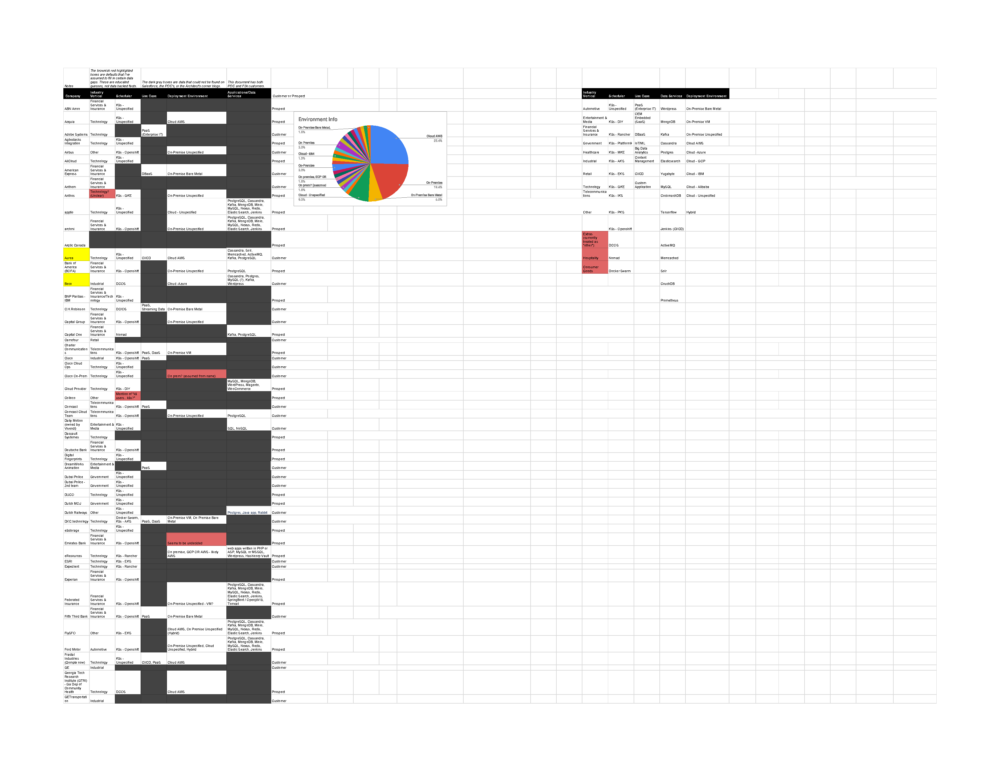
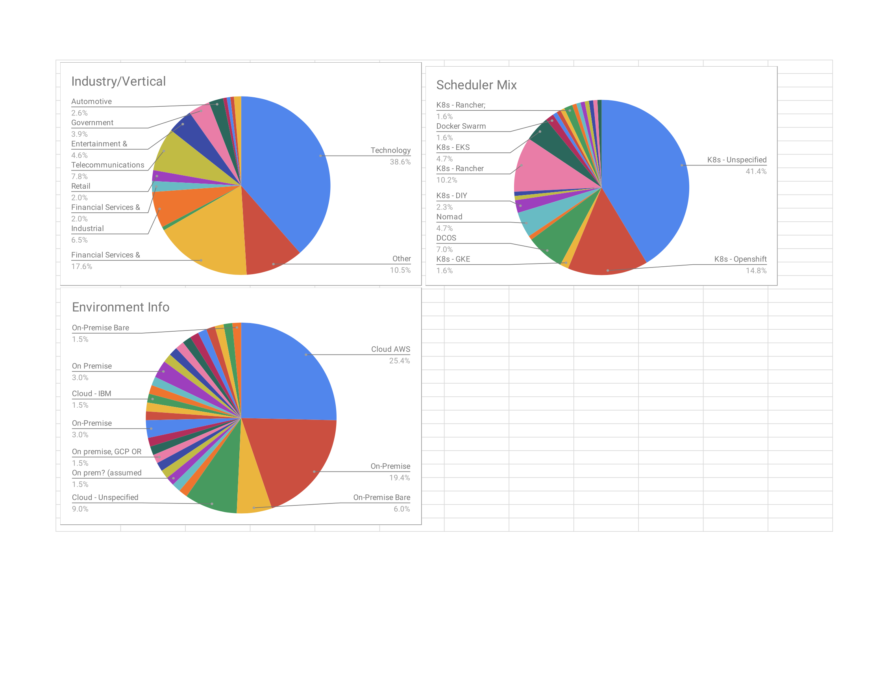
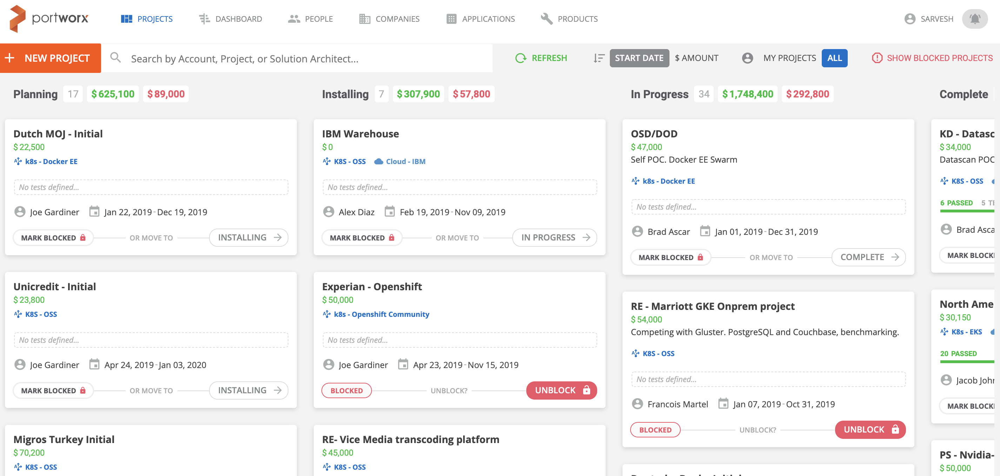
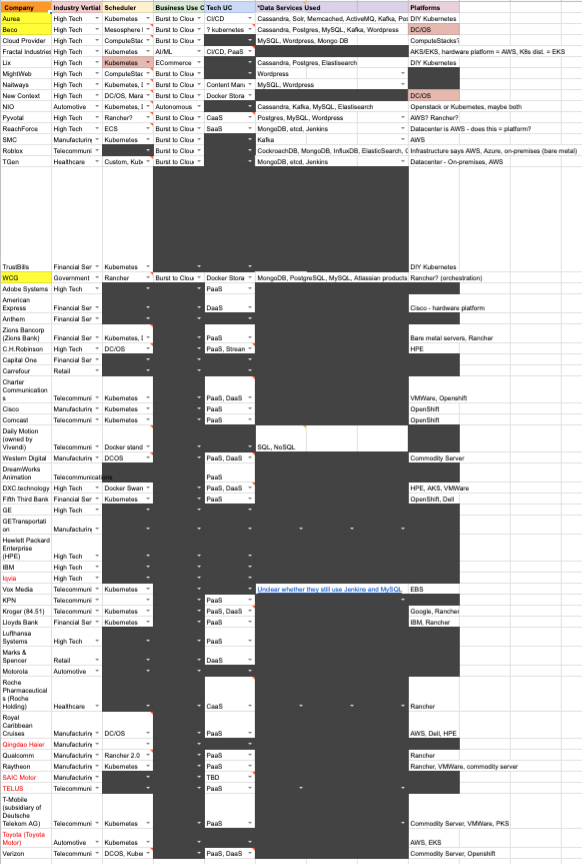
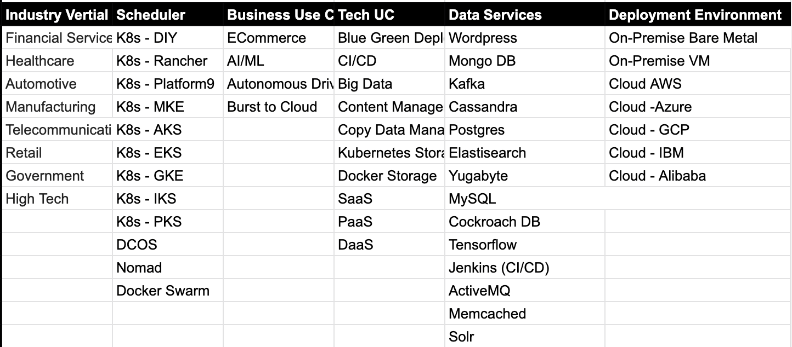
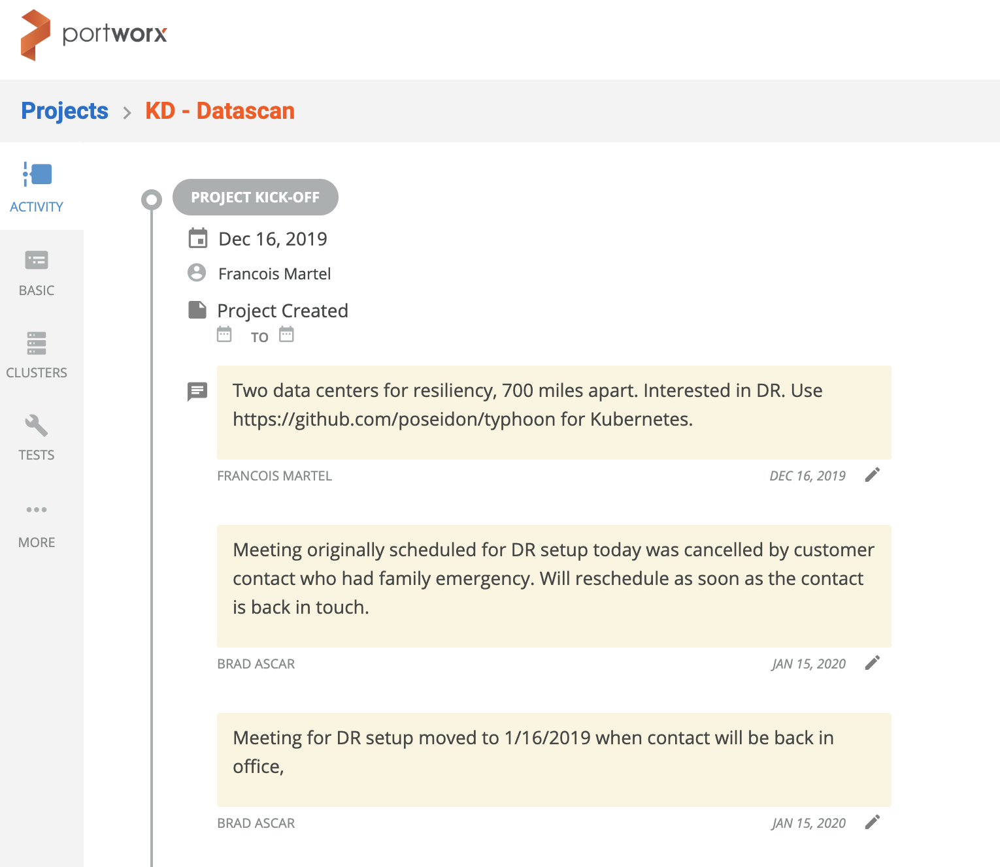

<!-- code is from https://www.w3schools.com/howto/howto_js_tab_img_gallery.asp -->
<html>
<head>
<meta name="viewport" content="width=device-width, initial-scale=1">

</head>
<body>

  <h2>Customer 360 Project</h2>
  <h3>Portworx Marketing Internship | June-August 2019</h3>

<!-- The four columns -->

  

    
  

  

    
  

  

    
  

  

    
  

  

    
  

  

    
  

  &times;
  
  

</body>
</html>

During my internship at Portworx, I worked on mining data and developing a database of customer info for the business-to-business facing company. The final result was a Customer 360 project, named for the 360 degree view of customer information the database allowed all teams in the company to access.

Previously, Portworx lacked a coordinated system of documentation for their individual customers. My project consisted of three steps:

1. Mining and collecting customer data across several categories, in a Google spreadsheet. Gathered data from Portworx's Salesforce, Trello, and Jira company accounts.
2. Parsed data on over 150 customer accounts and formatted it by industry vertical, scheduler type (Kubernetes, Docker, or Nomad), business application (AI/ML, ECommerce, Cloud, etc), use cases (SaaS, Content Management, Copy Data Management, Docker Storage, etc), Data Services (MongoDB, MySQL, Kafka, Cassandra, etc), and deployment environment (on premises or cloud).
3. Advised on and aided with the development of a custom app for Portworx, collaborating with a stealth startup to build the application. This application eventually went on to become the user interface for the data I organized and collected, and its' development was finished after my time at Portworx.

My advisor, Sarvesh Jagannivas, was intentional in his direction and extremely helpful to me during this project.
The end result of the C360 project was a link of communication between the company's sales and engineering teams. Organizing customer information allowed the engineering teams to observe their areas of weakness, and therefore to communicate with the sales and marketing teams on how the company could better improve their strategy. It also made the collection of customer information easy and intuitive, with the burden of organization and analysis now in the backend. 
The data and database are still in use past my time at the company, and continue to be improved and added to, to better fit the startup's adapting needs. 

